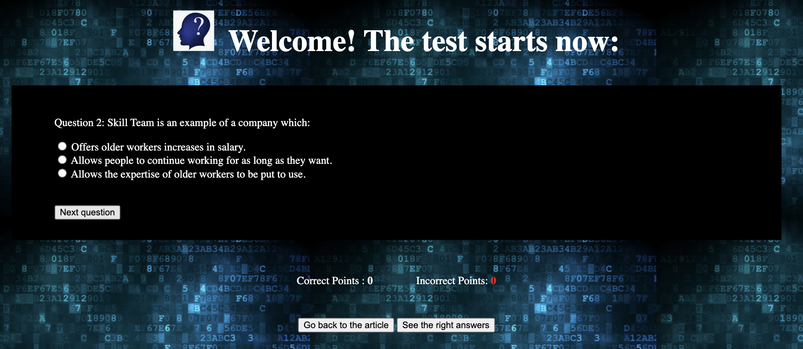

# Student Zone
The purpose of this website is to assist students in improving their reading skills for the IELTS level. It offers various features including an article selected by the website owner, multiple-choice questions, a scoring section, and a section displaying the correct answers.

The Student Zone utilizes JavaScript functions to enable students to navigate to different pages within the website and keep track of their scores by counting the number of correctly and incorrectly answered questions.

## Features:
This section will provide the user information of what features are available in Student Zone website.

### Logo and heading
The website has three main pages; the article, the questions, and the right answers.

#### 1. The article (in the main page):
Both the logo and the website name are picked to give the students a vibe of studying.

#### 2. The questions:
The heading is to to welcome the students and inform them that the test has started.

#### 3. The right answers:
The heading informs the students that in this page, the right answers of all the questions are to be found.

### The main page
This page is the first page that opens when the student opens the website, the student will directly be able to see that there is an article to be read and a button to click on whenever the student is ready to start the test.

### The footer (in the main page)
Here the student can be redirected to the original website where the quiz is taken from and can read more about the article.

### The questions page
When the student clicks on "start quiz", this section will be displayed, starting with:
#### - question 1:
This page shows the first question with three multiple choice answers to pick one from. A "next question" button is available to be clicked on when the student is ready to move on to the next question. The student is also able to to go back to the article page to read it again by clicking on the "Go back to the article" button and also can jump directly to see the right answers by clicking on the "See the right answers" button.
The score section is visible but unchanged until the user clicks on "sumbit my answers" when reached the last question.

#### - question 2:
This page shows the second question with three multiple choice answers to pick one from. A "next question" button is available to be clicked on when the student is ready to move on to the next question. The student is also able to to go back to the article page to read it again by clicking on the "Go back to the article" button and also can jump directly to see the right answers by clicking on the "See the right answers" button.
The score section is visible but unchanged until the user clicks on "sumbit my answers" when reached the last question.

#### - question 3:
This page shows the third question with three multiple choice answers to pick one from. A "next question" button is available to be clicked on when the student is ready to move on to the next question. The student is also able to to go back to the article page to read it again by clicking on the "Go back to the article" button and also can jump directly to see the right answers by clicking on the "See the right answers" button.
The score section is visible but unchanged until the user clicks on "sumbit my answers" when reached the last question.

#### - question 4:
This page shows the fourth and last question with three multiple choice answers to pick one from. A "Sumbit my answers" button is available to be clicked on when the student is done. The student is also able to to go back to the article page to read it again by clicking on the "Go back to the article" button and also can jump directly to see the right answers by clicking on the "See the right answers" button.
The score section is visible and will be changed when the user clicks on "sumbit my answers" to show the student how many points are right and how many are wrong.

### The answers page
When the student chooses to click "See the right answers", this page will be displayed. This page shows each question and which multiple choice answer is the correct one. A button of "Go back to the article" is also available in this page to redirect the student to the main page; the article. 

## Testing:
The testing was made on different sizes of devices, all the functions work perfectly fine. The background image is fixed to look nice in different sizes for all the different sizes of screens.
There are no issue testing the code and with the help of validator testing:

#### HTML

No errors were returned when passing the code of index.html, questions.html and answers.html through the official W3C validator

#### CSS

No errors were found when passing through the official (Jigsaw) validator

#### JavaScript

No errors were found when passing through the official Jshint validator
The following metrics were returned:
There are 8 functions in this file.
Function with the largest signature take 1 arguments, while the median is 0.
Largest function has 25 statements in it, while the median is 2.5.
The most complex function has a cyclomatic complexity value of 6 while the median is 2.

### Unfixed bugs:
There are no unfixed bugs found.

### Deployment
The site was deployed to GitHub pages:
First, in the GitHub repository, the studentZone is picked, the setting tab is picked,then pages are picked which are found under code and automation.
From the build and deployment section, the Main Branch is selected and saved.
The page will be automatically refreshed with a detailed ribbon display to indicate the successful deployment.
The live link can be found here - https://hebaabbas.github.io/studentZone/ 